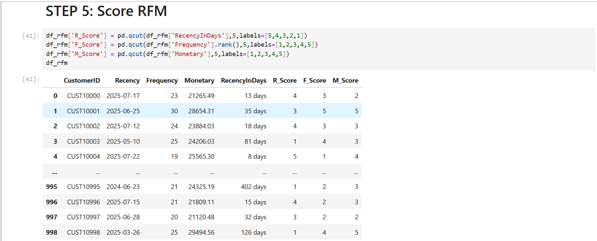
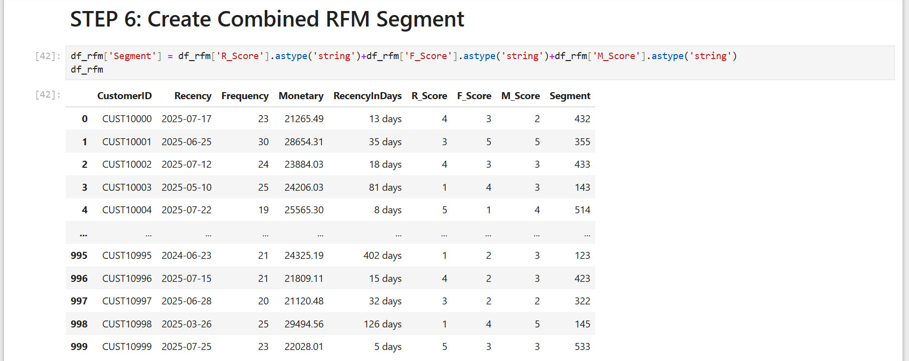
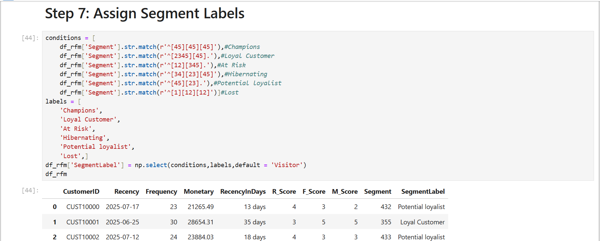
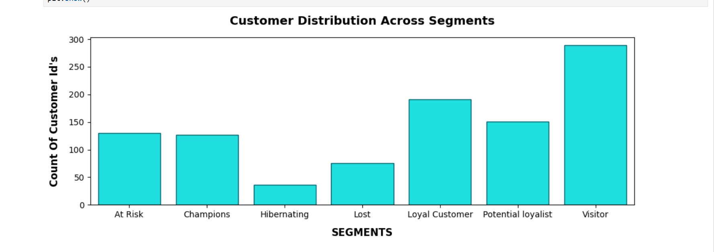
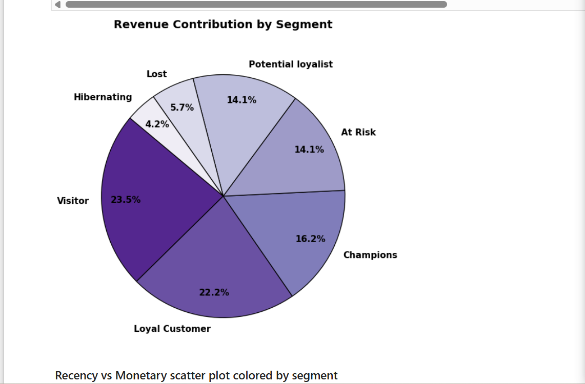
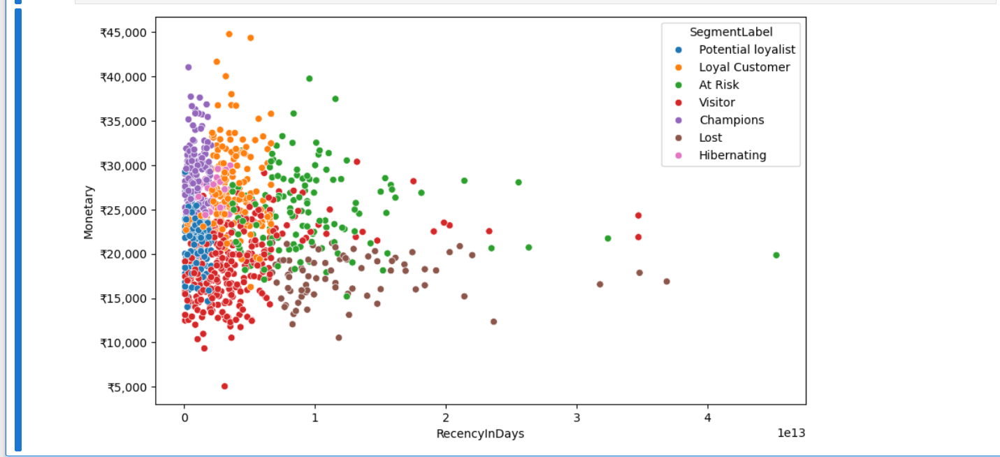
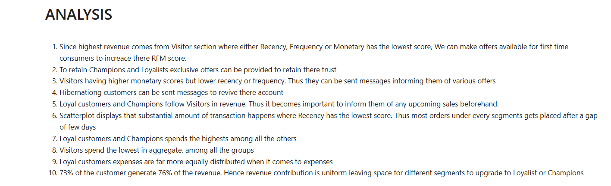

# customer-demographics-behavior-analytics

# Enterprise Customer Demographics & Behavioral Analytics

A comprehensive data analytics repository engineered to process customer profiles, track transaction frequencies, and extract consumer purchasing patterns. This project combines exploratory data analysis (EDA), automated data cleaning pipelines, and customer segmentation matrices to deliver actionable marketing intelligence and optimize lifetime account value.

---

## 1. Project Objective & Core Business Impacts

The goal of this framework is to analyze underlying demographic trends, map account enrollment velocities, and isolate core behaviors across our active customer network:

*   **Total Customer Footprint:** Comprehensive demographic and tracking profiles analyzed across the active database base.
*   **Multi-Dimensional Attributes:** Deep feature tracking mapping ages, gender distribution, marital status, income brackets, and transaction behaviors.
*   **Operational Intent:** Transitioning raw database records into clear customer segments to optimize marketing campaigns and drive data-backed retention plays.

---

## 2. Project Directory Structure

The repository files are organized according to clean production standards:

```text
customer-demographics-behavior-analytics/
│
├── data/
│   ├── Customer_Master_Data.csv       # Primary customer demographic profiles
│   ├── Customer_Master_Data.csv       # Master spreadsheet reference matrix
│   └── Customer_Transactions.csv      # Complete customer transactional logs
│   └── Customer_Master_Data.xlsx      # Raw backup data sheet workbook
│
├── assets/                            # Native documentation graphics container
│   └── readme-images/                 # Local relative asset store
│
├── customer_behavior_analytics.ipynb  # Exploratory Python analytics notebook
└── customer_behavior_executive_report.pdf # Ready-to-read executive data report
```

---

## 3. Data Cleaning & Engineering Ingestion Pipeline

To ensure all analytical calculations and downstream models are backed by clean, unpolluted data vectors, the notebook runs a rigorous data cleansing pipeline using **Pandas and NumPy**:

*   **Data Typing Standardization:** Programmatically formats dates (`JoinDate`) into standardized datetime objects to track cohort enrollment timelines.
*   **Null and Missing Value Management:** Defensively screens dataset arrays to locate missing values or null vectors, applying mathematical fill rules or isolating incomplete customer profiles.
*   **String Uniformity Mapping:** Standardizes categorical text columns (such as gender markers, marital statuses, and city strings) by stripping trailing whitespaces and fixing casing errors to protect grouping calculations.

---

## 4. Programmatic RFM Segmentation Architecture

To group our customer profiles into clear behavioral tiers, the analytics pipeline runs an RFM (Recency, Frequency, Monetary) scoring matrix. The system scores metrics from 1 to 5, groups them into text patterns, and maps them to target business brackets using conditional regular expressions:

<div align="center">
  <p><b>Step 5: Quantile RFM Scoring Matrix</b></p>
  
  <br>
  <table width="100%" style="border-collapse: collapse; border: none;">
    <tr style="border: none;">
      <td width="50%" style="padding: 5px; border: none; text-align: center;">
        <p><b>Step 6: Segment Concatenation Framework</b></p>
        
      </td>
      <td width="50%" style="padding: 5px; border: none; text-align: center;">
        <p><b>Step 7: Regex Label Mapping Engine</b></p>
        
      </td>
    </tr>
  </table>
</div>

---

## 5. Core Business Insights & Visual Metrics Ledger

### Customer Volume vs. Gross Financial Impact
Our segment mapping reveals a classic business trend where a small core group of high-value profiles generates the overwhelming majority of network cash flows:

<div align="center">
  <p><b>Customer Demographics vs. Revenue Contribution Side-by-Side Analysis</b></p>
  
  <table width="100%" style="border-collapse: collapse; border: none;">
    <tr style="border: none;">
      <td width="50%" style="padding: 5px; border: none; text-align: center;">
        <p><b>Volumetric Account Distribution Matrix Across Segments</b></p>
        
      </td>
      <td width="50%" style="padding: 5px; border: none; text-align: center;">
        <p><b>Standalone Macro Revenue Contribution Share</b></p>
        
      </td>
    </tr>
  </table>
</div>

*   **The Pareto Principal Proven:** Our analysis confirms that roughly **73% of our total customer base generates 76% of all gross network revenue**. 
*   **The High-Exposure Target:** While "Visitors" represent our largest segment volume at **28.9%**, they contribute a smaller relative share of revenue (**23.5%**). Conversely, "Champions" and "Loyal Customers" represent a combined tier that anchors our core financial stability.

### Recency vs. Monetary Distribution
The distribution plot maps out customer spending values against their recent connection timelines to isolate retention patterns:

<div align="center">
  <p><b>Recency vs. Monetary Multi-Dimensional Behavioral Scatter Space</b></p>
  
  <p><b>Algorithmic Verification Insights Ledger</b></p>
  
</div>

> **Production Optimization Note:** *The underlying model currently processes time gaps in nanosecond tracking dimensions due to raw timedelta datetime states. A post-launch optimization update is scheduled to extract explicit `.dt.days` integer properties to normalize the X-axis tracking metrics.*

---

## 6. Strategic Business Recovery Plan

Based on our segment findings, we established direct, actionable marketing playbooks to maximize customer lifetime value:

1.  **First-Time Consumer Campaign:** Launch entry-tier offers targeted directly at the high-volume **Visitor** bracket to increase transaction frequencies and build brand trust.
2.  **VIP Retention Campaigns:** Provide exclusive priority service upgrades and early sales access to **Champions** and **Loyal Customers** to protect our core revenue anchors from competitor poaching.
3.  **Accounts Re-Activation Channels:** Deploy automated email surveys and low-overhead value bundles to **Hibernating** accounts to revive inactive profiles without increasing customer service operating costs.

---

## 7. Deployment Architecture

*   **Data Aggregation Core:** Engineered entirely within a Jupyter Notebook pipeline using Python.
*   **Data Manipulation Toolkits:** Managed using Pandas dataframes and NumPy array select structures.
*   **Visual Presentation Graphics:** Rendered using Matplotlib and Seaborn plotting engines.
